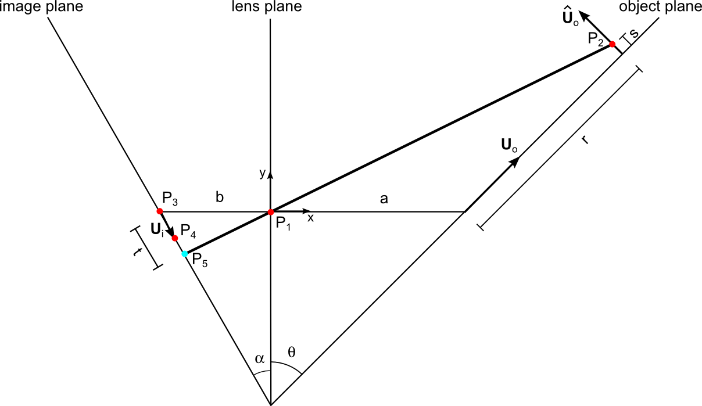

==============
Camera
==============

The camera and the camera calibration is handled by a the camera
object. There are several camera models implemented. Some details for
each camera model is given below.

Calibration for some of the camera models requires a set of object space
coordinates and their corresponding image plane coordinates. These sets
of coordinates can be extracted from calibration pictures. For more 
information see :ref:`Calibration image reading`

---------------------
Default Camera object
---------------------

This is the base class for other camerase simples camera is the base
class camera. This does not do much - it simply uses the same
coordinate system for object and image. This is convinient for some
tests and for other cases where only the image itself is of interest.

------------------
One2One model
------------------

This class is basically the same as the ``Camera`` class, but two
extra methods (``x2X`` and ``dx2dX``) are added to support
transformation from image coordinates to object coordinates.

This camera model can is initiated with the following commands:

::

    >>> from par2vel.camera import One2One
    >>> cam = One2One((x_size, y_size))

Where ``(x_size, y_size)`` are the camera sensor dimensions in
pixels. The camera functions will then be called from the ``cam``
object. For more details see `Examples on general applications`_.

------------------
Linear 2D model
------------------

PIV done with a single camera with a high quality lens, it is fair to
assume a simple linear relation between object space and the image
plane. We will call this 2D PIV since it is both two-dimensional (in a
plane) and two-component (in-plane velocity components). The mapping
between object and image is handles by a matrix that takes care of
translation, stretching and rotation:

.. math::
   \left[ 
   \begin{array}{c} 
       x_0 \\ x_1 
   \end{array} 
   \right] = 
   \left[
   \begin{array}{ccc}
       a_{11} & a_{12} & a_{13} \\ a_{21} & a_{22} & a_{23}
   \end{array} 
   \right]
   \left[
   \begin{array}{c}
      X_0 \\ X_1 \\ 1
   \end{array}
   \right]

Note that in this model we ignore the out-of-plane component
:math:`X_2` in the object space.

Calibration of the Linear2d model is done using a least square
method and by rewriting the above equation:

.. math::
    \left[ 
   \begin{array}{c} 
       x_0 \\ x_1 
   \end{array} 
   \right] = 
   \left[\begin{array}{cccccc}
   X_0 & X_1 & 1 & 0 & 0 & 0\\
   0 & 0 & 0 & X_0 & X_1 & 1
   \end{array}\right]
   \left[\begin{array}{c}
   a_{11} \\ a_{12} \\ a_{13} \\ a_{21} \\ a_{22} \\ a_{23}
   \end{array}\right]

The Linear2d camera object can be initiated and calibrated
using a set of object plane coordinets ``X`` and their
corresponding image plane coordinates ``x``. Note that
for this camera, both arrays should be :math:`2\times n`
dimensional.

::

    >>> from par2vel.camera import Linear2d
    >>> cam = Linear2d((x_size, y_size))
    >>> cam.calibration(x, X)

-------------------
Linear 3D model
-------------------

The linear model can be extented to three-dimensions. This model is
often referred to as the Direct Linear Transform (DLT).  Now all three
components of a point is included. An intermediate vector
:math:`\mathbf{k}` is calculated. The last value of this vector is
used to account for perspective effects.  

.. math::
   \left[ 
   \begin{array}{c} 
       k_0 \\ k_1 \\ k_2 
   \end{array} 
   \right] = 
   \left[
   \begin{array}{cccc}
       a_{11} & a_{12} & a_{13} & a_{14} \\ 
       a_{21} & a_{22} & a_{23} & a_{24} \\
       a_{31} & a_{32} & a_{33} & a_{34}
   \end{array} 
   \right]
   \left[
   \begin{array}{c}
      X_0 \\ X_1 \\ X_2 \\ 1
   \end{array}
   \right]

The perspective effect is done as

.. math::
   x_0 = \frac{k_0}{k_2}, \;\;\; x_1 = \frac{k_1}{k_2}

Just as for the `Linear 2D model`_, the ``Linear3d`` camera model
is also calibrated by using a least squares method. However, here
it is assumed that :math:`à_{34} = 1`. This should have no real
influence on the model as this assumption will only let the other
coefficients in the matrix scale themselves.

The Linear3D model is initiated as shown:

::

    >>> from par2vel.camera import Linear3d
    >>> cam = Linear3d((x_size, y_size))
    >>> cam.calibration(x, X)

Where ``x`` is an array containing camera coordinates, and ``X`` is
the array containing the corresponding 3 dimentional object space
coordinates. The arguments ``x_size`` and ``y_size`` are the sensor
resolution in pixels.

--------------------
Pinhole camera model
--------------------

The pinhole camera model is an extention of the Linear3D model that
takes common defects of an optical lens into account. The model works
in several steps:

1. A transformation like the Linear3D, but to intermediate coordinate
   system using object space scaling, with origin at intersection
   between image plane and optical axis and with axes aligned with
   camera chip.
2. A correction of optical destortion depending on radius from optical 
   axis and on tangential effects.
3. A simple mapping from the intermediate coordinates to the image 
   coordinates.

The first part is done with a translation vector :math:`t_i` and a
rotation matrix :math:`r_{ij}`. This method is quite similar to what
is done in the `Linear 3D model`_, the coordinates given by this
first step are noted :math:`\left[x_n,\;y_n\right]`. 

The intermediate coordinates are then corrected into another 
intermediate set of coordinates, that is corrected for
distortion. For this, :math:`r_n^2 = x_n^2+y_n^2` is used:

.. math::

    \left[
    \begin{array}{c}
    x_d \\ y_d
    \end{array}\right]
    = \left[
    \begin{array}{c}
    x_n \\ y_n
    \end{array}\right]
    \left(
    1 + k_1\cdot r_n^2 + k_2\cdot r_n^4 + k_3\cdot r_n^6
    \right) + \left[
    \begin{array}{c}
    2\cdot p_1\cdot x_n \cdot y_n + p_2\left(r_n^2+2\cdot x_n^2\right)\\
    p_1\left(r_n^2+2\cdot y_n^2\right) + 2\cdot p_2\cdot x_n\cdot y_n
    \end{array}\right]

Where :math:`k_1,\; k_2,\; k_3,\; p_1,\; p_2` are constants that are
computed during the calibration.

The new intermediate coordinates :math:`\left[x_d,\;y_d\right]` are now
transformed to find the final image plane coordinates. For that, the camera
matrix :math:`\mathbf{C}` is used to scale and translate the intermediate
coordinates. This last operation takes the form:

.. math::

    \left[ \begin{array}{c}
    x \\ y \\ 1
    \end{array}\right]
    = \left[\begin{array}{ccc}
    f_{11} & 0 & c_1\\
    0 & f_{22} & c_2\\
    0 & 0 & 1 \end{array}
    \right] \left[ \begin{array}{c}
    x_d \\ y_d  \\ 1\end{array} \right]

In the calibration, a guess on this matrix,  :math:`\mathbf{C}`, has to be
made. It has turned out to be a good guess to start with 
:math:`f_{11}=f_{22} = f`, where :math:`f` is the focal length. A good guess
for :math:`c_1` and :math:`c_2` is half of the sensor size in pixels (in
respectively the :math:`x` and :math:`y` direction).

The calibration for the pinhole model is iterative, first a guess for
:math:`\mathbf{C}` is made, then first assuming no distortion, a corresponding
rotation/translation matrix is  established. The distortion coefficients
can then be computed followed by the recomputation of the camera matrix
:math:`\mathbf{C}`. These steps are repeated until the mean error gets
below 0.5 pixel.

The pinhole model can be initiated as:

::

    >>> from par2vel.camera import Pinhole
    >>> cam = Pinhole((x_size, y_size))
    >>> cam.calibration(x, X)

Note that for the pinhole model, the functions for transforming image to 
object coordinates such as ``x2X`` and ``dx2dX`` require a lot of 
computational power as they are iterative. Therefore these functions
should be avoided when possible. Also, as the calibration can take a
lot of time, it should be considered to save the camera:

::

    >>> cam.save_camera(filename)

------------------------------
Third order camera model
------------------------------

This, third order, camera model may be suitable for applications, where a
lot of nonlinear effects occur between the object and the camera lense. 
This could for example be the case when a curved window is placed between
the camera and the flow. However, as the model is of third order, it
should be applied with cautioness as extrapolating from this model could
give some very unpredictible results.

The third order model is build on a linear operation between a 
:math:`2\times20` matrix, that contains all transformation constansts, 
and a 20 dimensional vector, that contains all third order combinations 
between the 3 coordinates in object space, including a constant for 
translation. 

The calibration of the third order model is done by using a set of image
plane coordinates ``x`` and the corresponding object space coordinates
``X``. A :math:`(2\cdot n)\times20` matrix is then set up in order to 
find the 20 constants using a least squares method.

::

    >>> from par2vel.camera import Third_order
    >>> cam = Third_order((x_size, y_size))
    >>> cam.calibration(x, X)

Just as for the pihole model, there are a lot of nonlinear terms in this
model, that make it non suitable for transformation from image plane to 
object space. Therefore the user should limit the use of the functions
``x2X`` and ``dx2dX`` with this model.

------------------------------
Scheimpflug model
------------------------------

The Scheimpflug configuration uses a tilted backplane of the camera to
create focus all over the image when the object plane is tilted with
respect to the lens plane. This is the case for stereoscopic PIV. The
condition is basically that the object plane, the lens plane and the
image plane should intersect at the same line in space. This is
illustrated on the figure below:

The pinhole is located at the point :math:`P_1` which is also the
origin of the coordinate system :math:`(x,y)`. We want to find the
image coordinates of a point :math:`P_2` in the object plane with
coordinates :math:`\mathbf{X}=(X_0, X_1, X_2)`. To ease the notation,
we let :math:`r=X_0` and :math:`s=X_2`. In the image plane we define
three points: :math:`P_3` is the intersection with the optical axis
(line through pinhole perpendicular to lens plane), :math:`P_4` is a
horizontal unit vector (length one pixel) away from
:math:`P_3`. Finally :math:`P_5` is the point that we want to
find. The parameter :math:`t` is the distance between the :math:`P_3`
and :math:`P_5` in pixels.

Only four parameters are needed to establish the calibration:

* Camera magnification :math:`M`
* Angle :math:`\theta` between object plane and camera lens
* Pixel pitch in the two image coordinate directions :math:`(p_0,p_1)`
* Focal length :math:`f`

The two first parameters our given specifically, the two last
parameters are standard parameters saved in the camera object. From
these parameters we can find the distances along the optical axis
:math:`a` and :math:`b` between lens and object plane and between lens
and image plane, respectively. We use the "lens makers formula" and
definition of :math:`M`:

.. math::

   \frac{1}{f} = \frac{1}{a} + \frac{1}{b} \;\; \land \;\;  M = \frac{b}{a} 
   \;\;\; \Rightarrow  \;\;\;  a = \frac{(M+1)f}{M}

It then follows that :math:`b = Ma`.  We also find the angle
:math:`\alpha` that the image plane (camera chip) has been tilted with
respect to the lens plane:

.. math::
   
   \frac{\tan \alpha}{\tan \theta} = \frac{b}{a} 
   \;\;\; \Rightarrow \;\;\; 
   \alpha = \tan^{-1}(M \tan \theta)

We define unit vectors in :math:`X_0` direction: :math:`\mathbf{U}_o =
(U_{ox}, U_{oy}) = (\sin \theta, \cos \theta)`, in :math:`X_2`
direction: :math:`\hat{\mathbf{U}}_o = (-U_{oy}, U_{ox})` and in first
image coordinate: :math:`\mathbf{U}_i = p_0(\sin \alpha, -\cos \alpha) =
(U_{ix}, U_{iy})`. 

The five points in the figure above have the following coordinates:

.. math::

   P_1 &= (0,0) \\
   P_2 &= (a,0) + r \mathbf{U}_0 + s \hat{\mathbf{U}}_0
          = (a + r U_{ox} - s U_{oy}, r U_{oy} + s U_{ox}) \\
   P_3 &= (-b , 0) \\
   P_4 &= (-b , 0) + \mathbf{U}_i = (-b+U_{ix}, U_{iy}) \\
   P_5 &= P_3 + t \mathbf{U}_i = (-b + t U_{ix}, t U_{iy})

We want to find the intersection point :math:`P_5` described by the
the parameter :math:`t` that corresponds to :math:`x_0`. We use a formula given by `Poul Bourke`_: 

.. _Poul Bourke: http://local.wasp.uwa.edu.au/~pbourke/geometry/lineline2d/

.. math::

   t &= \frac{(x_2-x_1)(y_1-y_3) - (y_2-y_1)(x_1-x_3)}
             {(y_4-y_3)(x_2-x_1) - (x_4-x_3)(y_2-y_1)} \\
     &= \frac{(a+rU_{ox}-sU_{oy}-0)(0-0) - (rU_{oy}+sU_{ox}-0)(0+b)}
             {(U_{iy}-0)(a+rU_{ox}-sU_{oy}-0) -
                (-b+U_{ix}+b)(rU_{oy}+sU_{ox}-0)} \\
     &= \frac{-b(rU_{oy} + sU_{ox})}
             {U_{iy}(a+rU_{ox}-sU_{oy}) - U_{ix}(rU_{oy}+sU_{ox})}

The find the other other image coordinate :math:`x_1`, we use a local
magnification :math:`M_L`:

.. math::

   M_L = \frac{|P_5 - P_1|}{|P_2-P_1|}
       = \sqrt{\frac{(-b + tU_{ix})^2 + (tU_{iy})^2}
                    {(a+rU_{ox}-sU_{oy})^2 + (rU_{oy}+sU_{ox})^2}}

Finally, since the image coordinte system have origin at the upper
left pixel, we need to add the image coordinates of the center of the
image censor, :math:`(x_{0,center}, x_{1,center})`:

.. math::

   x_0 &= t +  x_{0,center} \\
   x_1 &= M_L X_1/p_1 + x_{1,center}
 
To make the inverse function ``x2X``, we use the same principles to
get the following expression:

.. math::

   r = \frac{t U_{iy} a}{-U_{oy} b + t U_{oy} U_{ix} - t U_{ox}
   U_{iy}}

   
Note that we have set :math:`s=0`, i.e. we project the image
coordinates to the plane with :math:`X_2 = 0`.

The Scheimpflug camera model can be initiated with the sensor
size ``(x_size, y_size)``, the magnification number ``M``, and 
the angle ``theta`` between the optical axis and the object plane:

::

    >>> from par2vel.camera import Scheimpflug
    >>> cam = Scheimpflug((x_size, y_size))
    >>> cam.set_calibration(theta, M)

For this camera model, there is no function that evaluates
the best matching :math:`\theta` and :math:`M`, as the Scheimpflug
model is more of an ideal model, that can be used for approximations.
However, for precise data processing it would be better to use the
`Linear 3D model`_ or the `Pinhole camera model`_.

------------------------------------------------
Examples on general applications
------------------------------------------------

Given an initiated and calibrated camera ``cam``, there are different 
functions that all models include.

^^^^^^^^^^^^^^^^^^^^^^^^^^^^^^
Object space to camera plane
^^^^^^^^^^^^^^^^^^^^^^^^^^^^^^

The function ``X2x`` transforms a :math:`3\times n` dimensional 
object space array into a :math:`2\times n` camera plane array.

::

    >>> X = np.array([[1, 0],
                      [3, 4],
                      [0, 2]])
    >>> cam.X2x(X)
    array([[ 765.92925684,  833.31392541],
           [ 289.24050646,  196.63144335]])

In the same maner, the ``dX2dx`` function transforms displacements
``dX`` at ``X`` in object space to camera plane displacements:

::

    >>> dX = np.array([[0.05, 0.1],
                       [0.02, 0.03],
                       [0.01, 0.05]])
    >>> cam.dX2dx(X, dX)
    array([[ 3.80129231,  9.64629568],
           [-1.67767719, -2.45065128]])

^^^^^^^^^^^^^^^^^^^^^^^^^^^^^^
Camera plane to object space
^^^^^^^^^^^^^^^^^^^^^^^^^^^^^^

The function ``x2X`` transforms a :math:`2\times n` dimensional
camera plane array into a :math:`3\times n` dimensional object 
space array. However, as the system would be overdefined, it is
assumed that :math:`Z=0` i.e. ``X[2] = 0``.

::

    >>> x = np.array([[156, 678, 903, 473],
                      [213, 543, 341, 633]])
    >>> cam.x2X(x)
    array([[-8.13031631, -0.31750841,  3.23501752, -3.43239191],
           [ 3.56939502,  0.164335  ,  2.46943107, -0.82406899],
           [ 0.        ,  0.        ,  0.        ,  0.        ]])

The transformation of a displacements also assumes that the 3rd
component of the object space vector is 0, ``dX[2] = 0``.

::

    >>> dx = np.array([[13, 23, 21, 7],
                       [3, 12, 11, 17]])
    >>> cam.dx2dX(x, dx)
    array([[ 0.18259303,  0.36349372,  0.34863901,  0.10943624],
           [-0.02571028, -0.130682  , -0.11728821, -0.18387261],
           [ 0.        ,  0.        ,  0.        ,  0.        ]])

^^^^^^^^^^^^^^^^^^^^^^^^^^^^^^
Save and read cameras
^^^^^^^^^^^^^^^^^^^^^^^^^^^^^^

All parameters of a camera can be saved, such that it is only
necessary to calibrate a camera one time. The following times, 
where the camera is needed, only reading the file will be necessary.

::

    >>> filename = 'camera.dat'
    >>> cam.save_camera(filename)

A new camera ``cam_copy`` can now be established, and initiated, for
example as a pinhole camera (assuming ``cam`` also is a pinhole camera):

::

    >>> cam_copy = Pinhole()
    >>> cam_copy.read_camera(filename)

Now ``cam`` and ``cam_copy`` are two cameras with exactly the same
settings and calibrations:

::

    >>> cam.X2x(X) == cam_copy.X2x(X)
    array([[ True,  True,  True,  True],
           [ True,  True,  True,  True]], dtype=bool)
    >>> cam.shape == cam_copy.shape
    True