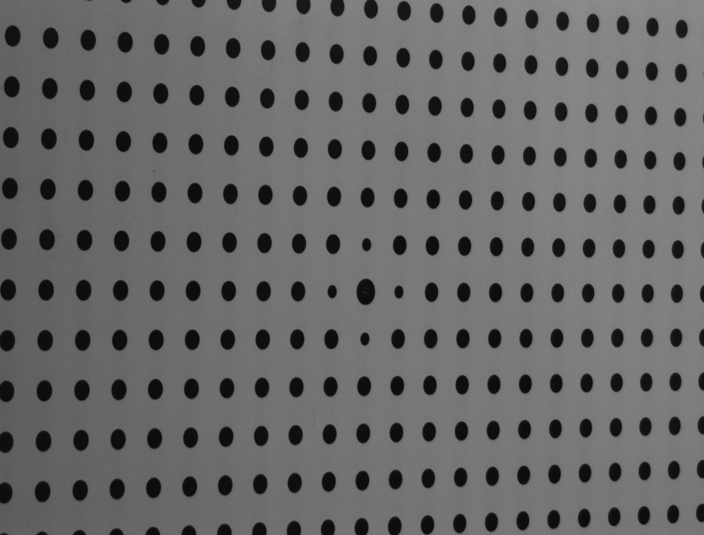

===========================
Calibration image reading
===========================

Calibrating a cammera requires a set of lense plane, image 
coordinates :math:`x` and their corresponding object space
coordinates, :math:`X`. In order to get this set of coordinates,
pictures of dots, in a plane parralell to the laser sheet, are
taken to create such a set of coordinates. Multiple pictures
are taken at different :math:`Z` coordinates.

The dots are to be arranged in an ortogonal coordinate system
like arragement. The resulting pictures should the look similar
to the one below:

To transform such a picture into a set of :math:`x` and :math:`X`
coordinates, the ``par2vel.Calibration_image`` object class can be 
used. Please be aware, that some parts of the object (the ones 
implying graphical point selection), are only supported by Python
consoles with `pop-up` plots, that support the matplotlib canvas.
This requirement is met by the spyder Python console. Furthermore,
the OpenCV library needs to be installed. This can be done, by
typing the following command into the terminal: ``$ pip install
opencv-python`` or ``$ pip3 insall opencv-python``.

An image similar to the one above can be imported into a new
object: ``img = Calibration_image(filename)``. When the image
has been imported, the user can call the function, that finds
the center of the dots. With images similar to the one above it is
a good approximation to fit ellipses to the dot contours. This is 
done by calling ``img.find_ellipses(edge_dist = list)``, where
the optional argument to ``edge_dist`` is either an integer or a 
4 dimentional list and is determinating how close to the edge
of the picture the centerpoints may be in order to be taken into
account. The default argument is ``edge_dist = [15, 15, 15, 15]``.

In order to find the ellipses, first the ``cv2.Canny`` function
is called on the image (this gives a matrix containing the contours
of the dots as ones and the rest of the image as zeros). The contours
are then found using ``cv2.findContours``, which are then fitted to 
ellipses with ``cv2.fitEllipse``.

-----------------------------
Selecting coordinate system
-----------------------------

The coordinate system in object plane has to be selected manually
for each image. By calling the function ``img.coordinate_system()``,
the image will open in a new window, and red crosses will be plotted
on each ellipse centerpoint. The user will be asked first to click on
the centerpoint, then on the first point of the :math:`X` axis and
finally on the first point of the :math:`Y` axis. When the user has
selected the coordinate, there will be the possibilty to click on
points, that should not be taken into account. This could for example
be ellipses that are found because of contrasts due to shaddows or dust.
However the user should also unselect points on the axes, such that 
all points on the axes belong to a complete line of dots in the other
axis direction (in the further processing, only rectangular grids are
handeled).

---------------------------
Find coordinates
---------------------------

As the coordinate system has been defined, the set of coordinates can
now be defined by calling two functions; first ``img.center_axis()``,
and then ``img.object_coordinates(X_spacing = [X_int, Y_int])``. 
The first function fits the coordinates of the selected points to 
the points, that are an ellipse center.

The second function first draws a two lines, both going through the 
centerpoint and the point defining the respective axis. by arranging 
the points, a set of image and object coordinates can be found for the
axes. The coordinates are then divided in four quadrants, which are 
processed separately.

In each quadrant, the strategy for finding the pixel coordinates
corresponding to some object coordintes is to establish a guess, by
using the points that are around the point :math:`\mathbf{x_4}`,
that has to be defined:

.. math::
    \begin{array}{cc}
    \mathbf{x_2} & \mathbf{x_4}\\
    \mathbf{x_1} & \mathbf{x_3}
    \end{array}

The guess for the coordinates of :math:`\mathbf{x_4}`,
:math:`\mathbf{x_{4 guess}}` is then:

.. math::
    \mathbf{x_{4, guess}} = \mathbf{x_2} + \mathbf{x_3} - \mathbf{x_1}

The the closest ellipse centerpoint to  :math:`\mathbf{x_{4, guess}}`
is then found and set to be  :math:`\mathbf{x_4}`. This method is
applied for each point, that does not lies on the axes. 

When all points are found , the object space :math:`X` and :math:`Y`
coordinates are then scaled by the optional parameter 
``X_spacing = [X_int, Y_int]``. If this parameter is not given as an
input to ``img.object_coordinates``, the :math:`X` and :math:`Y`
coordinates will not be scaled.

---------------------------
Save data
---------------------------

There are two options for saving the data into a file. The first 
possibilty is to create a new file with the
``img.save2file(Z, filename, description = str)`` function. ``Z``
should be the :math:`Z` position of the object coordinates. The 
optional imput, ``description`` can be any kind of string with 
information about the camera. Please note that calling this 
function will overwrite an eventual file with the same filename.

If the analyzed picture isn't the first one for this camera, then
the ``img.append2file(Z, filename)`` function should be used. The
data will then be appended to the existing file.

In the written files, each new :math:`Z` postion will begin with 
``Z = val`` followed by one set of coordinates in each row. The
coordinates are written in the following order: 
:math:`X\;\; Y\;\; x\;\; y` .